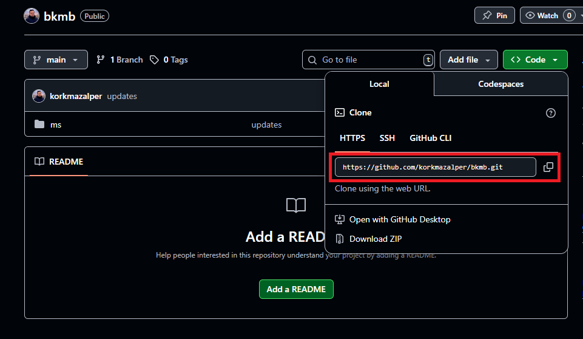
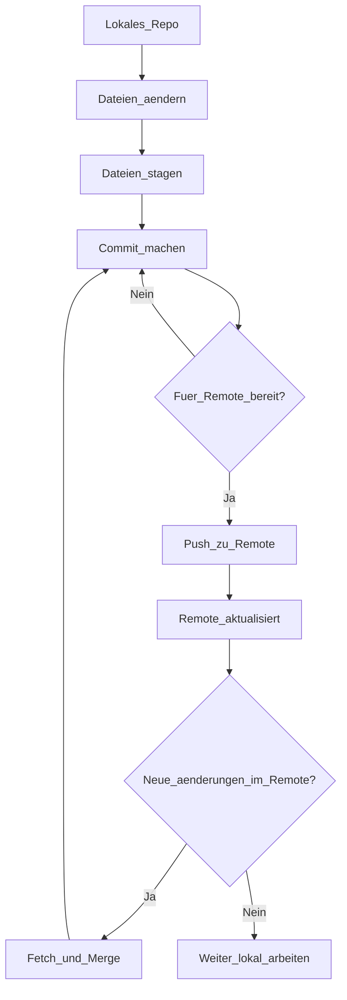

# Git
## Installation
-  "git download" googlen und installation von ``Git`` herunterladen
oder in CLI:
- `winget install --id Git.Git -e --source winget`
- check ob git installiert wird -> `git -v` in CLI
## Einstellungen
- `git config --global user.name "Alper Korkmaz"`
- `git config --global user.email "dr.alperkorkmaz@gmail.com"`

## `git clone`
um ein Repo in Remote zu lokalem Rechner zu duplizieren:
- öffne github repo und copy `REPO_LINK` [Code-Button] als `https` [bitte nicht als ``SSH``]

- in CLI ``git clone REPO_LINK`

## Struktur von Git

