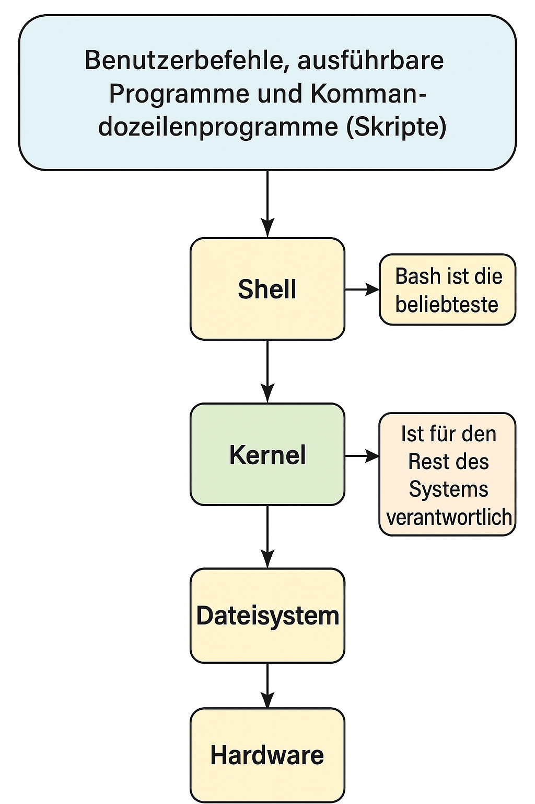
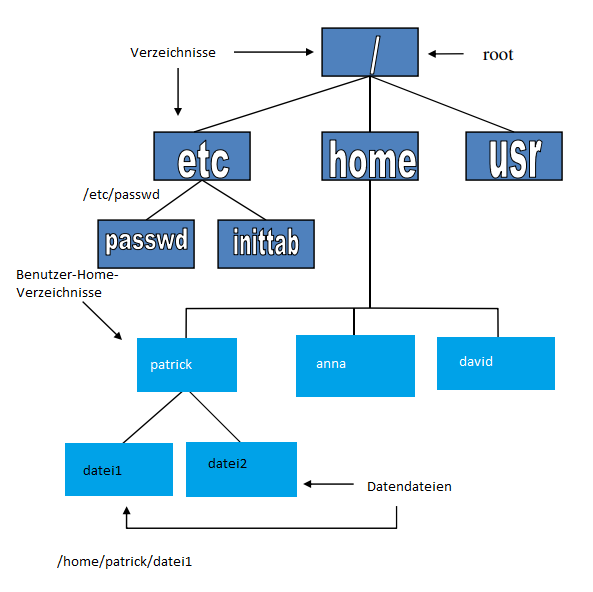
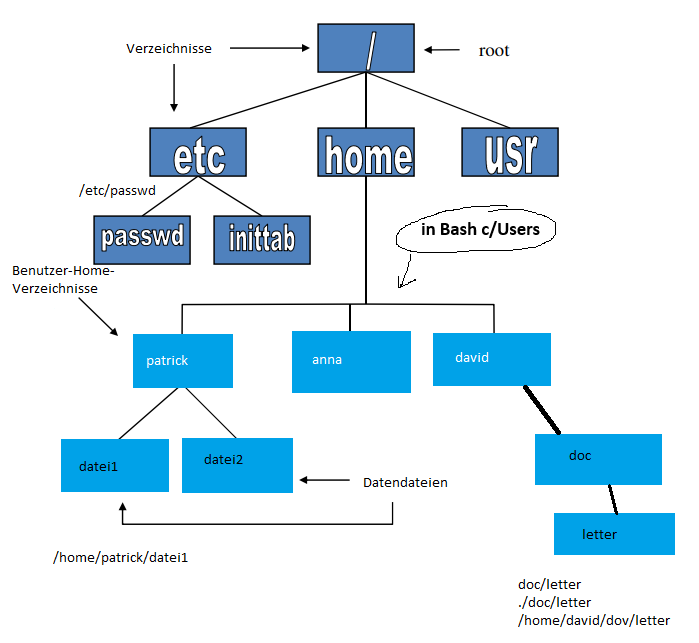

# Linux



## Was ist Linux?

- 32/64-Bit Unix-ähnliches Betriebssystem
    – Unix-Tools wie sed, awk und grep
    – Compiler wie C, C++, Fortran, Smalltalk, Ada
    – Netzwerk-Tools wie ssh (Telnet), sftp (FTP), ping, traceroute
- Mehrbenutzer-, Multitasking- und Multiprozessor-Fähigkeit
- X Windows GUI
- Kann zusammen mit anderen Betriebssystemen installiert werden
- Läuft auf vielen Plattformen
- Enthält Quellcode
- Kostenlos

## Dateistzruktur von Linux

Linux-Dateien sind ein Dateisystem mit einer hierarchischen Struktur mit einem einzigen Stammverzeichnis.



– Datendateien werden in Verzeichnissen gespeichert.
– Verzeichnisse können beliebig viele Unterverzeichnisse enthalten.
– Dateien können in Verzeichnissen gespeichert werden.

## Benennung von Dateien
– Beginnt im Stammverzeichnis
– Jedes Verzeichnis wird benannt

## Aktuelles Verzeichnis (Current (Working) Directory)
- Eines der Verzeichnisse ist das gültige (Arbeits-)Verzeichnis.
- Wenn das Zeichen ``/`` am Anfang des Dateipfads entfernt wird, beziehen sich die Dateipfade nun auf das aktuelle Verzeichnis.
- Um herauszufinden, in welchem Verzeichnis Sie sich befinden, können Sie den Befehl pwd verwenden.



## Spezielle Dateien und Verzeichnisse
• ``/home`` – alle Benutzerverzeichnisse werden hier gespeichert
• ``/bin``, ``/usr/bin`` – Systembefehle befinden sich in diesen Verzeichnissen.
• ``/sbin``, ``/usr/sbin`` – Befehle, die vom Systemadministrator verwendet werden, befinden sich in diesem Verzeichnis.
• ``/etc`` – alle Arten von Konfigurationsdateien
• ``/var`` – Verzeichnisse wie logs, spool
• ``/dev`` – Gerätedateien
• ``/proc`` – spezielle Systemdateien

## Systemeinloggungs- und -ausloggungsbefehle sowie Benutzerinformationsbefehle (ssh, login, logout, exit, passwd, whoami)
- ``passwd`` wird verwendet, um das Benutzerpasswort zu ändern.
- ``exit`` und ``logout`` ermöglichen es uns, uns aus dem Benutzerkonto abzumelden.
- ``whoami`` ermöglicht es uns, herauszufinden, wer der Benutzer eines offenen Kontos ist.

## Befehlsoptionen

Befehlsoptionen ermöglichen eine gewisse
Kontrolle über Befehle.
• Vereinbarung:
– Wird in der Regel zusammen mit einem Minuszeichen (–) und einem Buchstaben verwendet („-l“).
– Gelegentlich wird es zusammen mit zwei Minuszeichen (--) und einem Wort verwendet („--help“).
– Manchmal folgt auf den Befehl nichts.

## Linux-Befehlsstruktur
• Um einen Befehl auszuführen, geben Sie den Namen und gegebenenfalls die Optionen und Argumente ein.
• Die allgemeine Befehlsstruktur sieht wie folgt aus.


```bash
> ls -l /etc
```

## Jokerzeichen / Wildcards
### ?
ersetzt ein Zeichen / Character 
 ``file? file1, file2, files,...`` An der Stelle des Zeichens `?` kann ein beliebiges Zeichen stehen.

### * 
ersetzt eine Gruppe von Zeichen file1.*
file1.cc, file1.gz, file1.bmp An der Stelle des Zeichens * kann eine beliebige Zeichengruppe stehen.
• Diese beiden Zeichen ermöglichen es, die Befehle, die wir sehen werden, auf mehrere Dateien gleichzeitig anzuwenden. Sie werden nur zusammen mit Datei- und Verzeichnisnamen verwendet. Sie werden nicht mit Befehlen verwendet.

• ``[abc]`` enthält a oder b oder c.
• ``[^abc]`` enthält nicht a und b und c. (manchmal `!` statt `^` )
• ``.`` steht für das Arbeitsverzeichnis.
•``..`` steht für das Verzeichnis vor dem Arbeitsverzeichnis.

Bitte beachten Sie, dass diese Befehle in IDEs mit eingebettetem Bash wie VSCode möglicherweise nicht funktionieren.

## Dateien auflisten (ls)
• ``>ls`` listet die Dateien im aktuellen Verzeichnis auf.
• ``ls /home/anna`` listet die Dateien im Verzeichnis ``/home/anna`` auf.
• ``>ls –l`` listet die Dateien und zeigt Details wie Datum, Größe usw. an.
• ``>ls –ltr`` listet die Dateien in umgekehrter Reihenfolge nach dem Erstellungsdatum auf.
• ``>ls –lt`` listet die Details nach dem Erstellungsdatum der Dateien auf
• ``>ls –ltr`` listet in umgekehrter chronologischer Reihenfolge auf
• ``>ls –a`` zeigt auch versteckte Dateien an. Dateien mit der Endung . sind versteckte Dateien. Zum Beispiel ``.cshrc.``
• ``>ls –l *.cc`` listet Dateien mit der Endung cc detailliert auf.