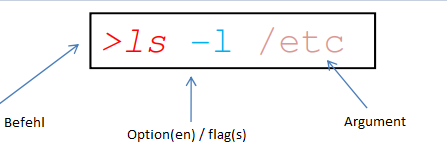

# Linux

## Was ist Linux?

- 32/64-Bit Unix-ähnliches Betriebssystem
  – Unix-Tools wie sed, awk und grep
  – Compiler wie C, C++, Fortran, Smalltalk, Ada
  – Netzwerk-Tools wie ssh (Telnet), sftp (FTP), ping, traceroute
- Mehrbenutzer-, Multitasking- und Multiprozessor-Fähigkeit
- X Windows GUI
- Kann zusammen mit anderen Betriebssystemen installiert werden
- Läuft auf vielen Plattformen
- Enthält Quellcode
- Kostenlos

## Dateistzruktur von Linux

Linux-Dateien sind ein Dateisystem mit einer hierarchischen Struktur mit einem einzigen Stammverzeichnis.

– Datendateien werden in Verzeichnissen gespeichert.
– Verzeichnisse können beliebig viele Unterverzeichnisse enthalten.
– Dateien können in Verzeichnissen gespeichert werden.

## Benennung von Dateien

– Beginnt im Stammverzeichnis
– Jedes Verzeichnis wird benannt

## Aktuelles Verzeichnis (Current (Working) Directory)

- Eines der Verzeichnisse ist das gültige (Arbeits-)Verzeichnis.
- Wenn das Zeichen `/` am Anfang des Dateipfads entfernt wird, beziehen sich die Dateipfade nun auf das aktuelle Verzeichnis.
- Um herauszufinden, in welchem Verzeichnis Sie sich befinden, können Sie den Befehl pwd verwenden.

## Spezielle Dateien und Verzeichnisse

• `/home` – alle Benutzerverzeichnisse werden hier gespeichert (in Bash/windows -> c/Users)
• `/bin`, `/usr/bin` – Systembefehle befinden sich in diesen Verzeichnissen.
• `/sbin`, `/usr/sbin` – Befehle, die vom Systemadministrator verwendet werden, befinden sich in diesem Verzeichnis.
• `/etc` – alle Arten von Konfigurationsdateien
• `/var` – Verzeichnisse wie logs, spool
• `/dev` – Gerätedateien
• `/proc` – spezielle Systemdateien

## Systemeinloggungs- und -ausloggungsbefehle sowie Benutzerinformationsbefehle (exit, passwd, whoami)

- `pwd` Der Befehl pwd (print working directory) ist einer der einfachsten, aber nützlichsten Befehle. Er gibt den absoluten Pfad des Verzeichnisses aus, in dem Sie sich gerade befinden. Dies ist besonders hilfreich, wenn man sich in der Verzeichnisstruktur verirrt hat oder um sicherzustellen, dass man Befehle am richtigen Ort ausführt. Die Ausgabe ist eine einfache Textzeile, die den Pfad von der Wurzel (`/`) bis zum aktuellen Standort anzeigt.

- `cd` Der Befehl cd (change directory) wird verwendet, um das aktuelle Verzeichnis zu wechseln. Mit cd [Pfad] kann man in ein bestimmtes Verzeichnis wechseln. Mit `cd ..` geht man eine Ebene höher, und mit `cd ~` gelangt man direkt ins Home-Verzeichnis des Benutzers.

- `passwd` wird verwendet, um das Benutzerpasswort zu ändern.

- `exit` und `logout` ermöglichen es uns, uns aus dem Benutzerkonto abzumelden.

- `whoami` ermöglicht es uns, herauszufinden, wer der Benutzer eines offenen Kontos ist.

## Befehlsoptionen

Befehlsoptionen ermöglichen eine gewisse
Kontrolle über Befehle.
• Vereinbarung:
– Wird in der Regel zusammen mit einem Minuszeichen (–) und einem Buchstaben verwendet („-l“).
– Gelegentlich wird es zusammen mit zwei Minuszeichen (--) und einem Wort verwendet („--help“).
– Manchmal folgt auf den Befehl nichts.

## Linux-Befehlsstruktur

• Um einen Befehl auszuführen, geben Sie den Namen und gegebenenfalls die Optionen und Argumente ein.
• Die allgemeine Befehlsstruktur sieht wie folgt aus.



```bash
> ls -l /etc
```

## Jokerzeichen / Wildcards

### ?

ersetzt ein Zeichen / Character
`file? file1, file2, files,...` An der Stelle des Zeichens `?` kann ein beliebiges Zeichen stehen.

### \*

ersetzt eine Gruppe von Zeichen file1._
file1.cc, file1.gz, file1.bmp An der Stelle des Zeichens _ kann eine beliebige Zeichengruppe stehen.
• Diese beiden Zeichen ermöglichen es, die Befehle, die wir sehen werden, auf mehrere Dateien gleichzeitig anzuwenden. Sie werden nur zusammen mit Datei- und Verzeichnisnamen verwendet. Sie werden nicht mit Befehlen verwendet.

• `[abc]` enthält a oder b oder c.
• `[^abc]` enthält nicht a und b und c. (manchmal `!` statt `^` )
• `.` steht für das Arbeitsverzeichnis.
•`..` steht für das Verzeichnis vor dem Arbeitsverzeichnis.

Bitte beachten Sie, dass diese Befehle in IDEs mit eingebettetem Bash wie VSCode möglicherweise nicht funktionieren.

- `ls` Dateiauflisten
  • `>ls` listet die Dateien im aktuellen Verzeichnis auf.
  • `ls /home/anna` listet die Dateien im Verzeichnis `/home/anna` auf.
  • `>ls –l` listet die Dateien und zeigt Details wie Datum, Größe usw. an.
  • `>ls –ltr` listet die Dateien in umgekehrter Reihenfolge nach dem Erstellungsdatum auf.
  • `>ls –lt` listet die Details nach dem Erstellungsdatum der Dateien auf
  • `>ls –ltr` listet in umgekehrter chronologischer Reihenfolge auf
  • `>ls –a` zeigt auch versteckte Dateien an. Dateien mit dem Punkt am Anfang sind versteckte Dateien. Zum Beispiel `.cshrc`
  • `>ls –l *.cc` listet Dateien mit der Endung cc detailliert auf.

- `touch` Der Befehl touch wird meistens verwendet, um eine leere Datei zu erstellen. Zum Beispiel: `touch test.txt` erstellt eine Datei mit dem Namen `test.txt`. Wenn die Datei schon existiert, wird lediglich `**das Änderungsdatum**` aktualisiert.
- `mkdir` Der Befehl `mkdir` (make directory) wird verwendet, um ein neues Verzeichnis (Ordner) zu erstellen. Beispiel: `mkdir Projekte` erstellt einen Ordner mit dem Namen Projekte. Mit mkdir -p pfad/zum/ordner können auch mehrere Ebenen auf einmal erstellt werden.
- `echo` Der Befehl `echo` wird verwendet, um Text oder Variablen im Terminal auszugeben. Beispiel: `echo Hallo Welt` zeigt Hallo Welt an. Auch nützlich, um Inhalte in eine Datei zu schreiben, z. B. `echo "Text" > datei.txt`
- `cat` Der Befehl `cat` (concatenate) wird meistens verwendet, um den Inhalt von Dateien im Terminal anzuzeigen. Beispiel: `cat text.txt` zeigt den Inhalt der Datei text.txt. Mit cat datei1 datei2 kann man auch mehrere Dateien hintereinander ausgeben. Zusätzlich lässt sich cat mit Umleitungen kombinieren, z. B. `cat > neu.txt`, um eine Datei neu zu erstellen und Text hineinzuschreiben.

# Linux – Übung: Dateiverwaltung und Befehle

## Aufgabe 1: Verzeichnisstruktur erstellen

- Home-Verzeichnis: Erstellen Sie ein Verzeichnis ProjektLinux.

- Wechseln Sie in das Verzeichnis ProjektLinux.

- Erstellen Sie die Unterverzeichnisse: Dokumente, Bilder und Skripte.

## Aufgabe 2: Dateien erstellen

- Wechseln Sie in das Verzeichnis Dokumente.
- Erstellen Sie die Dateien: `info.txt, todo.txt, notizen.txt`.

- Wechseln Sie in das Verzeichnis Skripte und erstellen Sie die Datei `start.sh`.

## Aufgabe 3: Inhalte in Dateien schreiben

- Schreiben Sie in `info.txt` den Text: "Dies ist eine Linux Übung."

## Aufgabe 4: Dateien anzeigen und zusammenführen

Zeigen Sie den Inhalt von `info.txt` und `todo.txt` im Terminal an.

Fügen Sie den Inhalt von `info.txt` und `todo.txt` in einer neuen Datei `gesamt.txt` zusammen.

## Aufgabe 5: Dateien und Verzeichnisse auflisten

Listen Sie alle Dateien im Verzeichnis ProjektLinux auf.

Listen Sie alle Dateien inkl. versteckter Dateien auf.

Zeigen Sie die Dateien sortiert nach Änderungsdatum an.

## Aufgabe 6: Pfade und Verzeichnisse

Prüfen Sie mit `pwd`, in welchem Verzeichnis Sie sich befinden.

Wechseln Sie ins Home-Verzeichnis mit `cd ~`.

Wechseln Sie zurück in das Verzeichnis ProjektLinux/Dokumente.

## Aufgabe 7: Benutzerinformationen

Zeigen Sie mit `whoami` Ihren aktuellen Benutzer an.

Ändern Sie das Passwort (nur zur Demonstration) mit `passwd`.

## Aufgabe 8: Wildcards verwenden

Listen Sie alle Dateien auf, die mit to beginnen.

Listen Sie alle `.txt` Dateien auf.

Verwenden Sie ein Muster, um Dateien aufzulisten, die `n` enthalten.

## Aufgabe 9: Dateien kopieren, verschieben und löschen

Kopieren Sie `todo.txt` nach `notizen.txt`.

Verschieben Sie `start.sh` in das Verzeichnis Dokumente.

Löschen Sie die Datei `gesamt.txt`.

## Aufgabe 10: Terminal-Befehle üben

Verwenden Sie `echo`, um "Linux macht Spaß!" in eine neue Datei `spaß.txt` zu schreiben.

Zeigen Sie den Inhalt der Datei mit `cat` an.

Kombinieren Sie mehrere Dateien mit `cat` und leiten Sie den Inhalt in eine neue Datei `alles.txt` um.

<!--
## Musterlösung

```bash
# Aufgabe 1
mkdir ProjektLinux
cd ProjektLinux
mkdir Dokumente Bilder Skripte
# Aufgabe 2
cd Dokumente
touch info.txt todo.txt notizen.txt
cd ../Skripte
touch start.sh
# Aufgabe 3
cd ../Dokumente
echo "Dies ist eine Linux Übung." > info.txt
# Aufgabe 4
cat info.txt todo.txt
cat info.txt todo.txt > gesamt.txt
# Aufgabe 5
cd ..
ls
ls -a
ls -lt
# Aufgabe 6
pwd
cd ~
cd ProjektLinux/Dokumente
# Aufgabe 7
whoami
passwd
# Aufgabe 8
ls to*
ls *.txt
ls *n*
# Aufgabe 9
cp todo.txt notizen.txt
mv ../Skripte/start.sh .
rm gesamt.txt
# Aufgabe 10
echo "Linux macht Spaß!" > spaß.txt
cat spaß.txt
cat info.txt todo.txt spaß.txt > alles.txt
```
-->
