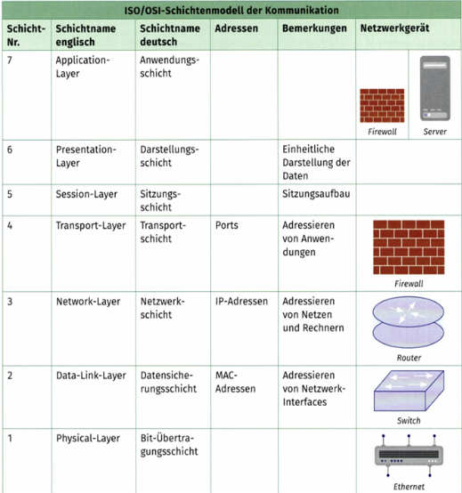
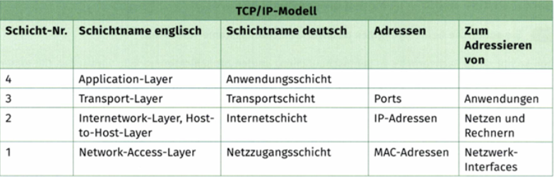
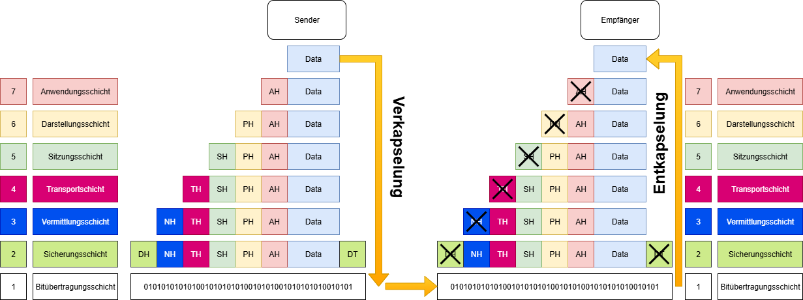

# OSI-Modell

- Ein Referenzmodell für Netzwerkprotokolle als Schichtenarchitektur.
- Ein Netzwerkprotokollstapel (engl. network protocol stack) bezeichnet die hierarchische Struktur von Netzwerkprotokollen.
- Sie sorgen dafür gemeinsam, dass zwei oder mehr Systeme in einem Netzwerk zuverlässig Daten austauschen können.
- Jeder Layer (Schicht) hat dabei eine spezifische Aufgabe, und die Protokolle einer Schicht bauen auf den Funktionen der darunterliegenden Schicht auf.
  
  Schicht 7: Anwendung (Application): Schnittstelle für Netzwerkdienste für Anwendungsprozesse.
  Schicht 6: Darstellung (Presentation): Übersetzung, Verschlüsselung und Komprimierung von Daten.
  Schicht 5: Sitzung (Session): Aufbau, Verwaltung und Beendigung von Sitzungen.
  Schicht 4: Transport (Transport): Gewährleistet die zuverlässige Übertragung von Daten von Ende zu Ende.
  Schicht 3: Vermittlung (Network): Verantwortlich für die logische Adressierung und das Routing.
  Schicht 2: Sicherung (Data Link): Physische Adressierung und Fehlererkennung.
  Schicht 1: Bitübertragung (Physical): Übertragung des rohen Bitstroms über das physikalische Medium.

# DoD-Modell (TCP/IP)

Parallel zu OSI entwickelte sich das TCP/IP-Modell mit seinen vier Schichten. Gelegentlich wird es auch DoD-Modell genannt, nach dem Department of Defense (Verteidigungsministerium der USA), das diese Entwicklung als Auftraggeber anfangs finanzierte.

# Aufgaben der Schichten

Anwendungsschicht (Application Layer)
– Schnittstelle für Anwendungen.
– Beispiele: HTTP, FTP, SMTP, DNS.

Darstellungsschicht (Presentation Layer)
– Übersetzt Datenformate, Verschlüsselung, Kompression.
– Beispiele: TLS/SSL, JPEG, ASCII/UTF-8.

Sitzungsschicht (Session Layer)
– Aufbau, Verwaltung und Beendigung von Sitzungen.
– Beispiel: NetBIOS, RPC.

Transportschicht (Transport Layer)
– Stellt Ende-zu-Ende-Kommunikation sicher (Fehlererkennung, Flusskontrolle).
– Beispiele: TCP, UDP.
Vermittlungsschicht (Network Layer)
– Adressierung und Routing der Datenpakete.
– Beispiel: IP (IPv4, IPv6)

Sicherungsschicht (Data Link Layer)
– Verantwortlich für fehlerfreie Übertragung von Datenrahmen (Frames).
– Beispiele: Ethernet (MAC), WLAN (802.11).
Bitübertragungsschicht (Physical Layer)
– Überträgt Bits über physische Medien (Kabel, Funk, Glasfaser).
– Beispiele: Ethernet-Kabel, WLAN-Signal.

# Verkapselung / Entkapselung

7. Schicht – Anwendung (Application Layer)
   Hier arbeiten Anwendungen wie Webbrowser, E-Mail-Client, FTP-Programme.

Funktion: Ein- und Ausgabe von Nutzdaten (Data).

Protokolle: HTTP, SMTP, FTP, DNS.

6. Schicht – Darstellung (Presentation Layer)
   Umwandlung der Daten in ein systemunabhängiges Format.

Verschlüsselung und Kompression.

Beispiele: JPEG, MP3, TLS/SSL.

5. Schicht – Sitzung (Session Layer)
   Steuerung, Aufbau und Abbau von Sitzungen (z. B. bei einer Client-Server-Kommunikation).

Verantwortlich für Dialogsteuerung und Synchronisation.

4. Schicht – Transport (Transport Layer)
   Segmentierung der Daten und Ende-zu-Ende-Kommunikation.

TCP (Transmission Control Protocol): verbindungsorientiert, zuverlässig, mit Sequenznummern und Bestätigungen.

UDP (User Datagram Protocol): verbindungslos, schneller, ohne Fehlerkorrektur.

Hier entstehen Transport-Header mit Quell- und Zielportnummern.

3. Schicht – Vermittlung (Network Layer)
   Verantwortlich für Routing und logische Adressierung.

IP (Internet Protocol): fügt Quell- und Ziel-IP-Adressen hinzu.

Protokolle: IPv4, IPv6, ICMP.

Hier entsteht der IP-Header.

2. Schicht – Sicherung (Data Link Layer)
   Verpackung der Pakete in Frames.

Nutzung von MAC-Adressen (Hardware-Adressen) zur Identifizierung von Sender und Empfänger.

Fehlererkennung durch Prüfsummen (CRC).

Protokolle: Ethernet, WLAN (802.11), PPP.

Hier entsteht der Frame-Header + Trailer.

2. Schicht – Sicherung (Data Link Layer)
   Verpackung der Pakete in Frames.

Nutzung von MAC-Adressen (Hardware-Adressen) zur Identifizierung von Sender und Empfänger.

Fehlererkennung durch Prüfsummen (CRC).

Protokolle: Ethernet, WLAN (802.11), PPP.

Hier entsteht der Frame-Header + Trailer.

# Reise eines Datenpakets durch die OSI-Schichten

7. Schicht – Anwendung (Application Layer)
   Erzeugt die eigentlichen Nutzdaten (z. B. HTTP-Request, E-Mail-Inhalt).

Fügt den Application Header (AH) hinzu.

Enthält Informationen für die Anwendung, z. B. welches Protokoll verwendet wird (HTTP, SMTP, FTP).

Ergebnis: [AH + Daten]

6. Schicht – Darstellung (Presentation Layer)
   Aufgabe: Formatierung, Verschlüsselung, Kompression.

Fügt den Presentation Header (PH) hinzu.

Enthält Informationen über Kodierung, Zeichensatz, Verschlüsselungsmethoden.

Ergebnis: [PH + AH + Daten]

5. Schicht – Sitzung (Session Layer)
   Aufgabe: Aufbau, Steuerung und Abbau von Sitzungen.

Fügt den Session Header (SH) hinzu.

Enthält z. B. Session-ID oder Synchronisationspunkte.

Ergebnis: [SH + PH + AH + Daten]

4. Schicht – Transport (Transport Layer)
   Aufgabe: Ende-zu-Ende-Verbindung zwischen Sender und Empfänger.

Fügt den Transport Header (TH) hinzu.

Bei TCP: Quellport, Zielport, Sequenznummer, Bestätigungen (ACK).

Bei UDP: Quellport, Zielport, Prüfsumme.

Ergebnis: [TH + SH + PH + AH + Daten]

3. Schicht – Vermittlung (Network Layer)
   Aufgabe: Routing und logische Adressierung.

Fügt den Network Header (NH / IP-Header) hinzu.

Enthält Quell-IP, Ziel-IP, TTL (Time to Live), Fragmentierungsinfos.

Ergebnis: [NH + TH + SH + PH + AH + Daten]

2. Schicht – Sicherung (Data Link Layer)
   Aufgabe: Sicherung und physikalische Adressierung über MAC-Adressen.

Fügt den Data Link Header (DH) hinzu.

Enthält Quell-MAC und Ziel-MAC.

Fügt zusätzlich einen Trailer hinzu (z. B. CRC-Prüfsumme zur Fehlererkennung).

Ergebnis: [DH + NH + TH + SH + PH + AH + Daten + Trailer]

1. Schicht – Bitübertragung (Physical Layer)
   Aufgabe: Umwandlung des Frames in Bits und physikalische Signale (elektrisch, optisch oder Funk).

Überträgt die Bits über Kabel, Glasfaser oder Funk.

# Aufgabe: Datenkapselung und Segmentierung im OSI-Modell

Ein HTTP-Request (10 KB groß) soll von einem Client zu einem Server übertragen werden.
Anwendung bis Sitzung (Schichten 7–5):

Erklären Sie, welche Header in diesen Schichten hinzugefügt werden (AH, PH, SH).

Werden diese Header bei der Segmentierung erneut erzeugt oder nur einmal hinzugefügt?

Transportschicht (Schicht 4):

Die 10 KB Daten werden in 5 Segmente à 2 KB aufgeteilt.

Beschreiben Sie, wie der Transport-Header (TH) hinzugefügt wird.

Stellen Sie dar, wie Segment 1 und Segment 2 aussehen.

Vermittlungsschicht (Schicht 3):

Erklären Sie, wie aus den Segmenten IP-Pakete werden.

Welche Informationen stehen im Network Header (NH)?

Sicherungsschicht (Schicht 2):

Beschreiben Sie, wie jedes IP-Paket in einen Frame verpackt wird.

Welche Rolle spielen der Data Link Header (DH) und der Trailer (CRC)?

Zusatzfrage:

Zeichnen Sie eine Übersicht, die zeigt, wie die Daten von [AH + Daten] bis zu [DH + NH + TH + SH + PH + AH + Daten(Teil) + Trailer] gekapselt werden.

# Musterlösung

1. Anwendung bis Sitzung (Schichten 7–5)
   Die Header AH, PH, SH werden jeweils einmal hinzugefügt.

Sie enthalten Informationen für Protokoll (AH), Datenformat/Verschlüsselung (PH) und Sitzungsverwaltung (SH).

Bei der Segmentierung werden sie nicht erneut erzeugt, sondern bleiben unverändert im Payload enthalten.
[SH + PH + AH + Daten (10 KB)] 2. Transportschicht (Schicht 4)
Die 10 KB werden in 5 Segmente à 2 KB aufgeteilt.

Jedes Segment bekommt einen eigenen Transport-Header (TH).

Enthält: Quellport, Zielport, Sequenznummer, Prüfsumme.

Beispiel:
Segment 1: [TH + SH + PH + AH + Daten(Teil 1, 2 KB)]
Segment 2: [TH + SH + PH + AH + Daten(Teil 2, 2 KB)]
… 3. Vermittlungsschicht (Schicht 3)
Jedes Segment wird in ein IP-Paket verpackt.

Der Network Header (NH) wird hinzugefügt.

Enthält: Quell-IP, Ziel-IP, TTL, Routing-Infos.
Paket 1: [NH + TH + SH + PH + AH + Daten(Teil 1)]
Paket 2: [NH + TH + SH + PH + AH + Daten(Teil 2)]
...

4. Sicherungsschicht (Schicht 2)
   Jedes IP-Paket wird in einen Frame verpackt.

Data Link Header (DH): Quell-MAC, Ziel-MAC.

Trailer (CRC): Fehlererkennung.
Frame 1: [DH + NH + TH + SH + PH + AH + Daten(Teil 1) + Trailer]
Frame 2: [DH + NH + TH + SH + PH + AH + Daten(Teil 2) + Trailer]
…

5. Bitübertragungsschicht (Schicht 1)
   Die Frames werden in Bits und Signale (elektrisch, optisch, Funk) umgewandelt.

Übertragung über das Medium.
