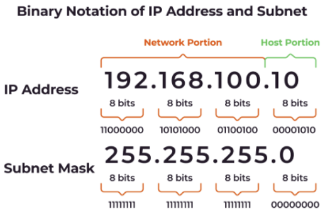
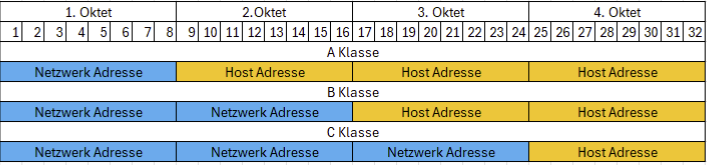
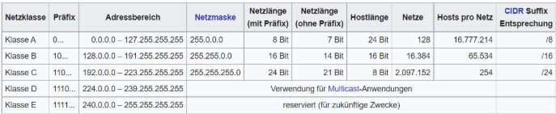
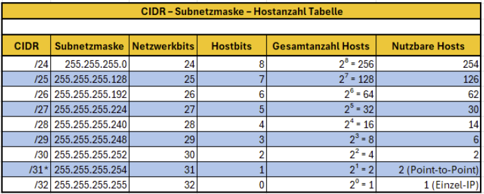

# Subnetting

Jedes Gerät in einem Netzwerk muss eine **IP-Adresse** haben.  
Die Geräte kommunizieren über diese IP-Adresse miteinander.

Zum Beispiel, wenn in einer Schule alle Labore oder Klassenzimmer in einem Raum wären, wäre Unterricht kaum möglich und die Verwaltung sehr schwierig. Deshalb befinden sich Labore und Klassenzimmer in separaten Räumen und dienen bestimmten Zwecken.

**Subnetting** erstellt eine hierarchische Struktur. Dadurch wird das Netzwerk effizienter, der Datenverkehr reduziert und die Verwaltung vereinfacht.

---

## IPv4

- Besteht aus **32 Bit**.
- Unterteilt in 4 **8-Bit-Oktette**, getrennt durch Punkte.
- Jedes Oktett kann Werte von 0–255 annehmen (2^8 = 256 Werte).

Eine IP-Adresse besteht aus zwei Teilen:

1. **Netzwerkadresse:** Zeigt das Netzwerk, mit dem das Gerät verbunden ist.
2. **Host-Adresse:** Zeigt die Nummer des Geräts im Netzwerk.
   

### IP-Klassen

- **Klasse A:** Maximal 16.777.214 Geräte
- **Klasse B:** Maximal 65.534 Geräte
- **Klasse C:** Maximal 254 Geräte
  

### Übersicht der Netzklassen

### CIDR-Darstellung

Zum Beispiel `/24` → die ersten 24 Bits sind für das Netzwerk reserviert, 8 Bits für Hosts.

- `/24 = 255.255.255.0`
  

---

## Broadcast-Adresse

- Adresse, an die alle Geräte im Netzwerk gesendet werden.
- Jede Subnetz hat die **höchste IP-Adresse** als Broadcast-Adresse.

**Beispiel:** 192.168.1.0/24

- **Netzwerk:** 192.168.1.0
- **Broadcast:** 192.168.1.255
- **Hosts:** 192.168.1.1 – 192.168.1.254

---

## Gateway (Standard-Gateway)

- Ermöglicht Geräten die Kommunikation außerhalb ihres eigenen Subnetzes.
- Normalerweise wird die **erste nutzbare IP-Adresse** des Subnetzes gewählt.

**Beispiel:** 192.168.1.0/24 → Gateway: 192.168.1.1

---

## Dynamische und Statische IP-Nutzung

| IP-Typ            | Definition                                         | Anwendungsbereiche                                                                                              | Vorteile                                                                                                 | Nachteile                                                                   |
| ----------------- | -------------------------------------------------- | --------------------------------------------------------------------------------------------------------------- | -------------------------------------------------------------------------------------------------------- | --------------------------------------------------------------------------- |
| **Statische IP**  | Manuell zugewiesen, ändert sich nicht              | Server, Drucker, Netzwerkgeräte, Überwachungskameras, intelligente Kühlschränke, Backöfen und andere IoT-Geräte | Immer dieselbe IP erreichbar, zuverlässige Verbindung                                                    | Bei großen Netzwerken schwer zu verwalten, menschliche Fehler möglich       |
| **Dynamische IP** | Automatisch über DHCP zugewiesen, kann sich ändern | Computer, Mobilgeräte, Gäste-Geräte                                                                             | Einfach zu verwalten, geringes Risiko von IP-Konflikten, automatische Verteilung bei wachsendem Netzwerk | Nicht immer dieselbe IP erreichbar, für bestimmte Dienste nicht zuverlässig |

**Hinweis:** Für IoT-Geräte in Smart Homes kann eine DHCP-Reservierung verwendet werden; die IP-Adresse bleibt dann gleich, aber die Verwaltung bleibt automatisch.

---

## Beispiel /26 Subnetz

IP: 192.168.1.0/26

- **Subnetzmaske:** 255.255.255.192
- **Host-Bits:** 6 → 2^6 = 64 IP-Adressen
- **Netzwerk:** 192.168.1.0
- **Broadcast:** 192.168.1.63
- **Nutzbare Hosts:** 192.168.1.1 – 192.168.1.62
- **Gateway:** 192.168.1.1

## Beispiel: /26-Netz

IP: 192.168.1.0/26 => 26 Bit -> Netzwerk, 6 Bit Host

Subnetzmaske: 255.255.255.192 -> 8 bit= 255 , 11000000=128 + 64= 192

Hostbits: 6 Bit → 64 IP-Adressen gesamt =2^6= 64

Netzwerkadresse: 192.168.1.0

Broadcast-Adresse: 192.168.1.63

Nutzbare Hosts: 192.168.1.1 – 192.168.1.62

Gateway: meist 192.168.1.1
