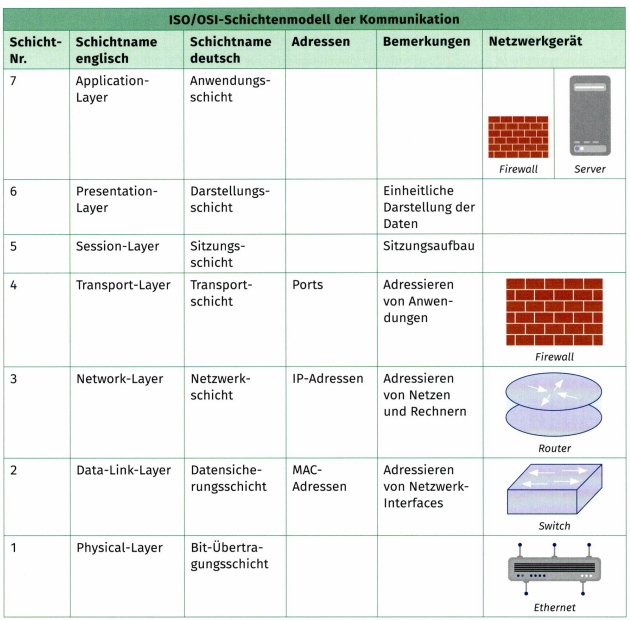

# Netzwerk
## OSI-SchictenModel

## DoD-Modell (TCP/IP-Modell)

## Die Funktion der einzelnen Schichten

- Anwendugnsschicht (Application Layer)

    Hier befinden sich die Anwendungsprogramme
        - Browser, Web-Server, E-Mail-Client u. -Server, Datenbank-Client u. -Server
- Darstellungsschicht (Presentation Layer)
Die Darstellung von Zahlen, Zeichen, Buchstaben wird hier vereinheitlicht, damit unterschiedliehe Systeme Daten austauschen können. Die Zeichen werden immer in einem einheitlichen
Format ausgetauscht. 
- Sitzungsschicht (Session Layer)
Hier bauen zwei Kommunikationspartner eine Sitzung auf, vergleichbar einem Telefongespräch, bei dem auch zu Beginn durch Nennen der Namen sichergestellt wird, dass man miteinander reden möchte. 
- Transportschicht (Transport Layer)
Diese Schicht ist für den sicheren Datenaustausch verantwortlich. Hier werden die Daten überprüft, ob sie korrekt angekommen sind. Fehlen Daten oder sind sie fehlerhaft, dann werden sie auf dieser Schicht erneut angefordert. Anwendungen werden mit Ports (``Port-Adressen``) adressiert.
- Netzwerkschicht (Network Layer)
Auf der Netzwerkschicht werden Netzwerke adressiert und Pakete von einem Netzwerk in ein anderes geroutet. Router arbeiten auf diesem Layer. Üblicherweise werden hier IP-Adressen verwendet. IP-Adressen beinhalten einen Netzanteil und einen Hast-Anteil, sodass ein Zielrechner und sein Netz genau definiert sind. 

- Datensicherungsschicht (Data-Link-Layer)
Beim Senden wird aus den Sendedaten ein Bit-Strom erstellt bzw. beim Empfänger werden aus einem Bit-Strom wieder die Originaldaten hergestellt. Die Bits werden in logische Einheiten zu 8 Bit (``ein Oktett``) zusammengefasst. **MAC-Adressen** befinden sich auf dieser Schicht. Mit ihnen werden die Netzwerk-Interfaces adressiert. 

- Bit-Übertragungsschicht (Physical Layer)
Auf der Bit-Übertragungsschicht wird mit Leitungscodes definiert, wie Bits oder Bit-Muster auf dem Medium übertragen werden. Ein High kann beispielsweise 5 V und ein Low -5 V haben. Es können aber auch Bit-Muster (``mehrere Bits gleichzeitig``) in verschiedenen Spannungen dargestellt werden.